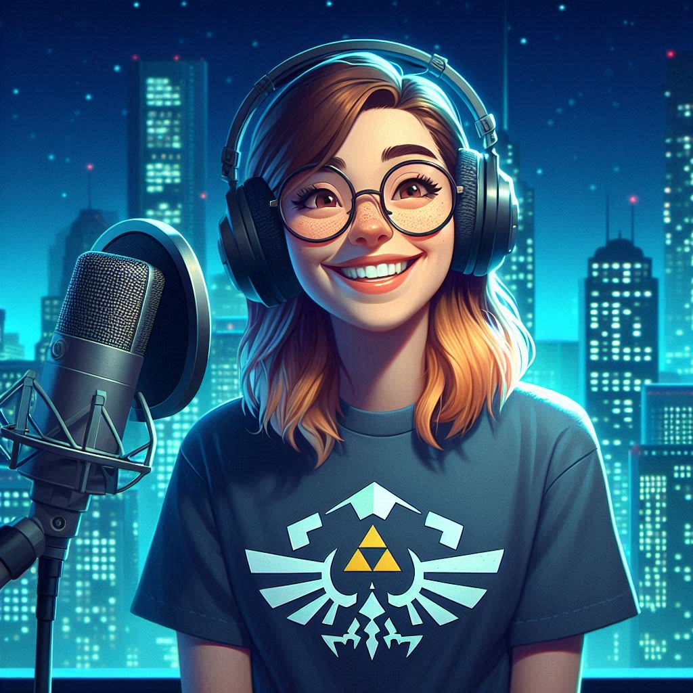

<h1 align="center"> 🎬 Vídeo criado com IA </h1>

---

## 📓 Descrição
> ℹ️ Este vídeo apresenta uma visão rápida e envolvente do potencial e da aplicação das IAs Generativas na vida cotidiana.

🤖 Tecnologias Utilizadas

- 🧠 [ChatGPT](https://chat.openai.com/) para roteirização
- 🎨 [Copilot](https://copilot.microsoft.com/) para criar imagens
- 🎬 [D-ID](https://studio.d-id.com/) para geração de avatar virtual
- 🎧 [ElevenLabs](https://elevenlabs.io/) para sintetização de voz

---
## ✅ Como foi feito ?

- Roteiro gerado pelo ChatGPT e Gemini
- Áudio gerado pelo ElevenLabs
- Copilot para gerar imagens
- D-ID utilizado para criar um avatar virtual + o áudio criado no ElevenLabs

## ⭐ Resultado
O vídeo demonstra rapidamente de forma simples o que as IAs Generativas são capazes de fazer e transformar.

<a href="https://github.com/chellegeek/create-a-podcast-IA/tree/main/output" > 🎬 CLIQUE AQUI para assistir o vídeo </a>

---
## 👩‍💻 Aprendiz

    
    
&nbsp&nbsp&nbsp&nbspMichelle Garcia 
    &nbsp&nbsp&nbsp
    <a href="https://github.com/chellegeek">
    GitHub</a>&nbsp;|&nbsp;
   <a href="https://www.linkedin.com/in/michelle-
garcia-/">LinkedIn</a>
&nbsp;|&nbsp;
    <a href="https://www.instagram.com/chellegarciami/">
    Instagram</a>
&nbsp;|&nbsp;

  

